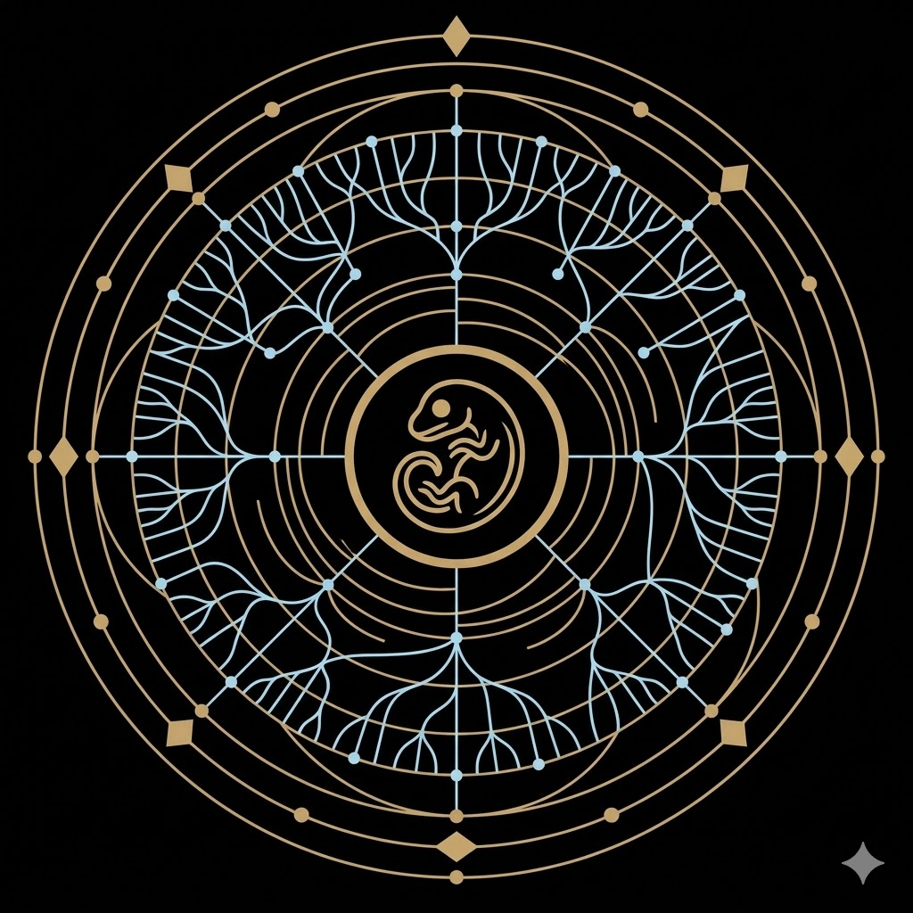

<div align="center">
  
  <h1>DeepTime Sauropsida</h1>
  <h3>交互式蜥形纲演化树 · 沉浸式深时导览</h3>

  <p>
    <b>从二叠纪晚期的主干分化，到今日仍存的鸟类、鳄类、龟鳖与鳞龙。</b><br>
    把现生蜥形纲放回 3 亿年的深时背景中重新观看。
  </p>

  <p>
    <b>中文</b> | <a href="README_EN.md">English</a>
  </p>

  <p>
    
    
    
  </p>
</div>

---

## 📖 简介 (Introduction)

**DeepTime Sauropsida** 是一个运行于现代浏览器端的交互式数据可视化项目，尝试把现生蜥形纲重新放回更长的演化时间轴中展示。项目以 3D 螺旋序幕、动态演化树和节点资料卡的组合方式，呈现鸟类、鳄类、龟鳖类、喙头类与有鳞类之间的系统关系。

当前版本以“**鸟类到目，其余现生主线到科**”为主要展示粒度，共整理 **126 个末级节点** 与 **64 个内部分类节点**。在节点过密的支系中，额外补入下目、总科等中间层，以保持树形结构和可读性。

> **🌟 亮点：** 项目包含一个“溯源：失落的蜥形时代”彩蛋视图，会把镜头从现生冠群拉回到蜥形纲更深的中生代辐射历史。

## ✨ 核心特性 (Features)

### 🌌 沉浸式 3D 序幕
- **双螺旋画廊**：基于 `Three.js + CSS3DRenderer` 构建的卡片序幕，用视觉节奏引导用户进入主树。
- **粒子背景与平滑运镜**：使用 WebGL 粒子和补间动画串联开场、转场和树图视图切换。

### 🌿 交互式演化图谱
- **D3.js 动态时间树**：支持缩放、拖拽、展开与收起，按时间轴横向展开现生蜥形纲主树。
- **地质时间轴**：底部动态标尺展示当前视口对应的年代范围。
- **节点资料卡**：点击节点文字可查看中英文名称、时间范围和说明信息。
- **智能搜索**：支持中文与拉丁名搜索、匹配高亮和快速定位。

### 🌐 国际化支持
- **中英文切换**：界面、节点名称、说明文本和时间范围均可在中英文之间切换。
- **语言联动彩蛋视图**：彩蛋树中的节点名称和资料卡也会跟随语言同步刷新。

### 🥚 溯源彩蛋 (The Easter Egg)
- 点击界面左上角“溯源”按钮，可进入一棵包含大量灭绝旁支的幽灵树。
- 该视图强调蜥形纲在海洋、陆地与天空中的中生代大辐射，以及通向现生类群的少数幸存主线。

### ⚡ 性能与体验
- **响应式布局**：桌面端和移动端分别配置粒子密度、树宽和初始缩放参数。
- **资源懒加载**：`images_data.js` 以异步方式加载，避免阻塞首屏。
- **纯静态部署友好**：无需后端，即可直接通过本地文件或静态托管运行。

## 🛠️ 技术栈 (Tech Stack)

本项目采用 **Vanilla JavaScript (ES6+)** 开发，无构建步骤，适合直接预览与静态部署。

* **Core**: HTML5, CSS3, JavaScript
* **Visualization**: [D3.js](https://d3js.org/) (v7) - 负责演化树布局、缩放和节点交互。
* **3D Engine**: [Three.js](https://threejs.org/) (r128) - 负责 3D 螺旋画廊、粒子背景与 CSS3D 场景。
* **Animation**: [Tween.js](https://github.com/tweenjs/tween.js/) - 负责相机和界面过渡动画。
* **Fonts**: Noto Serif SC & Playfair Display (via Google Fonts)

## 📂 目录结构 (Structure)

项目主体是一个纯前端静态站点，数据、图像映射和交互逻辑都已包含在仓库中。

```text
Sauropsida-tree/
├── assets/                  # Logo 等静态资源
├── data/                    # 演化树数据与图像索引
│   ├── data.js             # 主树数据
│   ├── image_generation_status.json
│   └── images_data.js      # 图片数据映射
├── result/
│   └── webp_q75/           # 预处理后的物种/类群图片资源
├── scripts/                 # 数据整理与图片处理脚本
├── src/
│   ├── css/
│   │   └── style.css       # 主样式文件
│   └── js/
│       ├── config.js       # 布局与性能配置
│       ├── easter_egg_data.js  # 彩蛋树数据
│       ├── i18n.js         # 国际化文本
│       ├── main.js         # 应用主逻辑
│       └── utils.js        # 工具函数
├── index.html               # 入口页面
├── README.md                # 中文说明
└── README_EN.md             # English Documentation
```

## 🚀 本地运行 (How to Run)

### 方式一：直接打开
1. Clone 或下载本仓库。
2. 直接打开 `index.html`。
3. 若浏览器策略较宽松，可直接体验主要功能。

### 方式二：本地服务器
如果你希望避免部分浏览器的本地文件限制，建议启动一个静态服务器：

```bash
# Python 3
python -m http.server 8000

# Node.js
npx http-server -p 8000
```

然后访问 `http://localhost:8000`

## 🔬 数据范围与说明 (Data Scope)

* **分类基准**：主要参考 **Reptile Database** 与 **IOC World Bird List**。
* **层级策略**：鸟类以目级为末端，其余现生蜥形纲主线以科级为末端；对过密分支补入总科、下目等中间层。
* **时间信息**：高阶节点优先采用常见冠群分化时间，末级节点时间以便于可视化整理的近似冠群时间为主。
* **彩蛋视图**：额外扩展了大量已灭绝旁支，用于展示蜥形纲在深时尺度上的辐射与收缩。
* **图像资源**：当前重点仍是树结构、节点时间与说明文本；图像资源正在继续补齐与校正。

## 🔧 可调配置 (Customization)

项目的大部分显示参数集中在 `src/js/config.js`：

```javascript
performance: {
    particleCount: { desktop: 2000, mobile: 1000 },
    cardCount: { base: 30, densityFactor: 25, min: 35, max: 80 }
},

scene3D: {
    helix: { radiusBase: 600, radiusMax: 800, yStep: 30 },
    camera: { targetZDesktop: 2000, targetZMobile: 1400 }
},

tree: {
    width: { desktop: 2000, mobile: 1200 },
    nodeSpacing: 45,
    zoom: { scaleExtent: [0.15, 3] }
}
```

## 🤝 致谢与声明 (Credits & Disclaimer)

* **分类与时间基准**：参考 Reptile Database、IOC World Bird List 以及部分近年的蜥形纲、龟鳖类与鸟类系统发育研究。
* **技术实现**：项目基于 D3.js、Three.js 与 Tween.js 的纯前端组合实现。
* **当前阶段**：现阶段优先保证树结构、节点时间和交互流程清晰，后续会继续补充资料来源、配图与节点细节。

## 📄 开源协议 (License)

本作品采用 [知识共享署名-非商业性使用-相同方式共享 4.0 国际许可协议 (CC BY-NC-SA 4.0)](http://creativecommons.org/licenses/by-nc-sa/4.0/) 进行许可。

* ✅ 你可以自由分享和修改本项目。
* ❌ 不可用于商业用途。
* 📝 转载或修改请注明原作者：**Sean Wong**。

---

<div align="center">
  <sub>Designed with ❤️ by Sean Wong</sub>
</div>
